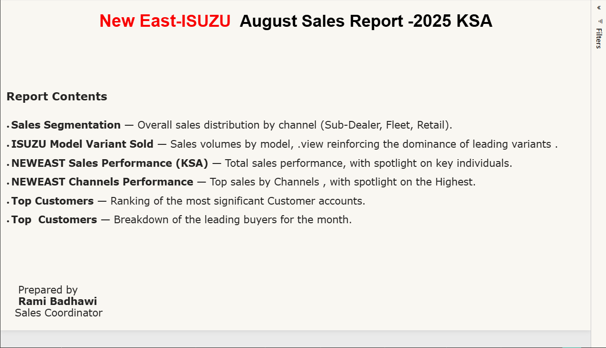
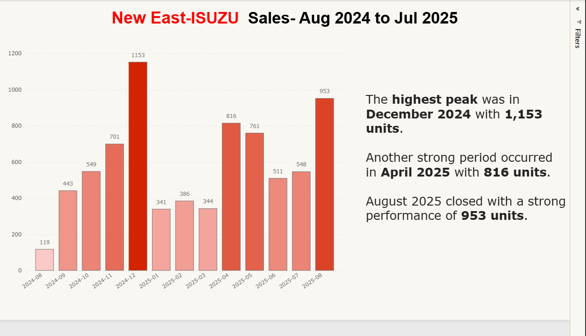

# Neweast Isuzu August Sales Report

**Description:**  
Interactive Power BI dashboard presenting August sales performance for Neweast Isuzu.  
Note: Original data not included.

**Dashboard Pages & Highlights:**  
1. **Introduction:** NewEast Isuzu August Sales Report overview  
2. **Sales Segmentation:** Analyze sales distribution across segments  
3. **Sales by Variant:** Compare performance of different product variants  
4. **Sales by Salesman:** Track individual salesperson performance  
5. **Sales by Channel:** Analyze sales across different channels  
6. **Top Customer:** Identify top-performing customers  
7. **Customer Matrix:** Visualize customer distribution and insights

**Tools Used:**  
Power BI Desktop

**Screenshots:**  

